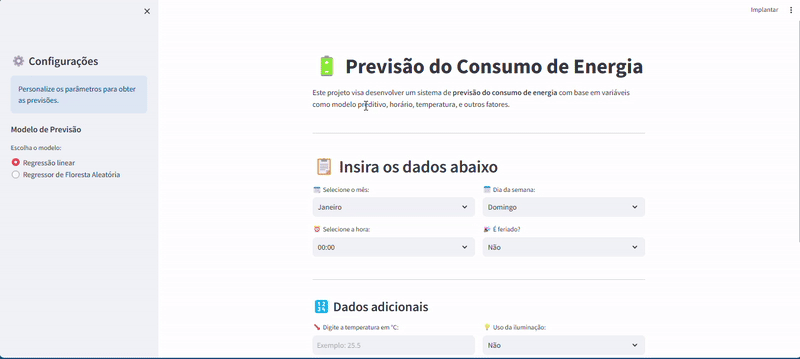

# 🔋 Predição de Consumo de Energia

Este projeto tem como objetivo aplicar técnicas de **aprendizado de máquina** para realizar a **predição do consumo de energia** com base em dados históricos. A solução envolve desde o pré-processamento de dados até a aplicação de modelos de machine learning, avaliação de desempenho e visualização dos resultados.

  
   
  <em>Visualização da predição em tempo real</em>

---

## 🚀 Tecnologias Utilizadas

- Python 3.10+
- Pandas, Numpy
- Scikit-learn
- Matplotlib, Seaborn
- Jupyter Notebook / VSCode

---

## 📊 Metodologia

1. **Coleta e análise dos dados**
2. **Pré-processamento e normalização**
3. **Clusterização (opcional)**
4. **Treinamento de modelos supervisionados**
5. **Validação cruzada e ajuste de hiperparâmetros**
6. **Visualização de resultados e métricas de avaliação**

---

## 📁 Estrutura do Projeto

├── Streamilit model/ # front end com streamilit
├── notebooks/ # Jupyter notebooks com experimentos
├── Anexos
├── README .md # Documentação do projeto
